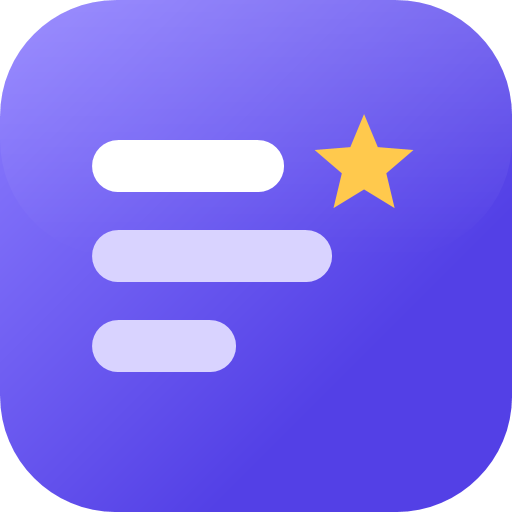
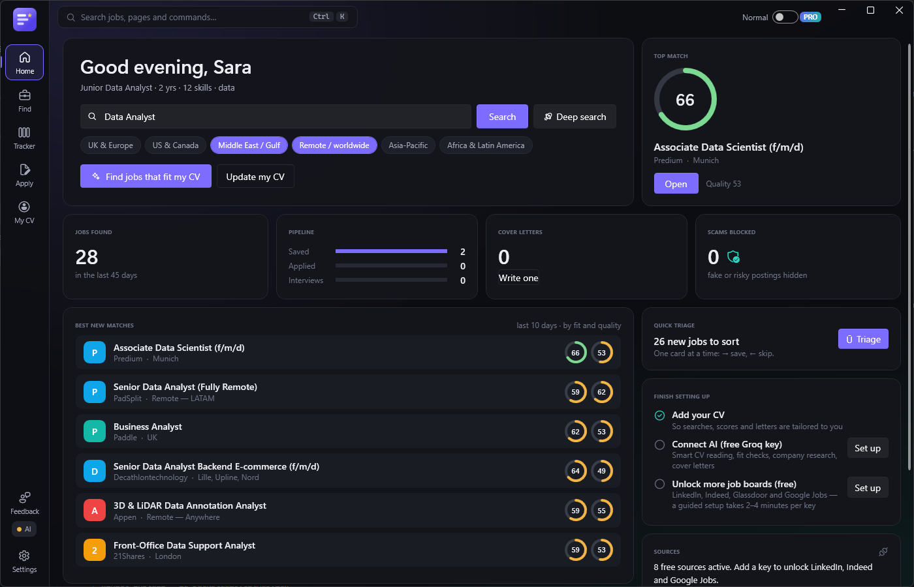
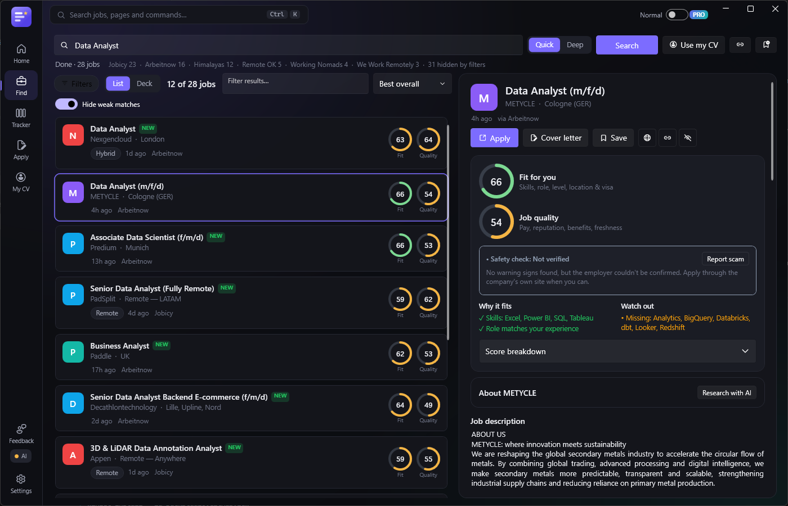
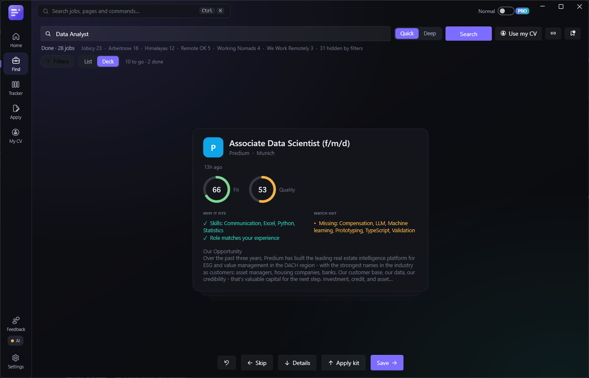
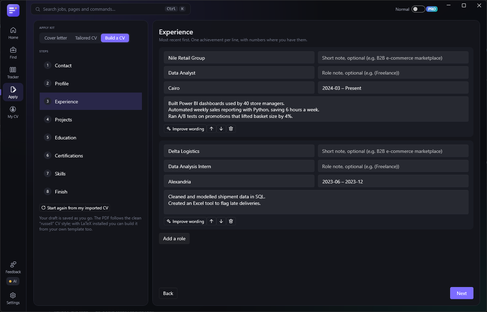

<h1 align="center">Shortlist</h1>

<b>Find jobs that actually fit you — and skip the scams.</b> 
A free Windows app that searches many job sites at once, scores every job for you, and helps you apply.

  <b>🚧 Public beta opening soon</b> — watch this repo (Watch → Custom → Releases) to hear when the first download is out
  &nbsp;·&nbsp; Windows 10 / 11 &nbsp;·&nbsp; Public beta 1.1

| Find jobs: every job scored for fit and quality | Card Deck: sort new jobs one at a time |
|---|---|
|  |  |
| **CV builder: a simple form becomes a clean PDF** | |
|  | |

Screenshots use a made-up demo profile.

---

## What it does

- 🔎 **One search, many job sites.** LinkedIn, Indeed and Glassdoor (with a free key), plus Adzuna, Google Jobs, Reed, remote-job boards and companies' own career pages. Search by a job title or a whole field such as "Data & Analytics" or "Nursing".
- 🚀 **Deep search.** Runs for a few minutes and finds many more jobs. It tries related job titles and looks at companies that hire in your field.
- 🎯 **Two scores for every job:**
  - **Fit:** how well it matches your CV, experience, location and visa needs.
  - **Quality:** pay, employer reputation, benefits and freshness.
- 🛡️ **Scam shield.** Warns about upfront fees, chat-app-only "recruiters", too-good-to-be-true pay and brand-new websites. Employers reported by several testers are flagged for everyone.
- 👻 **Ghost-job detector.** Spots ads that are reposted again and again, have stayed up for months, or are only "collecting CVs".
- ✈️ **Visa sponsorship.** Checks the job text and the official UK, Dutch and US sponsor lists.
- 🃏 **Card Deck.** Go through new jobs one at a time: → save, ← skip, ↑ apply.
- ✍️ **Apply kit:**
  - Cover letters written from your real CV, and checked so nothing is made up.
  - A tailored CV for each job, with a keyword-match score before and after.
  - A **CV builder** that turns a simple form into a clean PDF or Word CV.
- 📋 **Tracker.** Keep every application in one place: saved, applied, interview, offer.
- 🔗 **Add any job from a link,** or with the browser button for Edge and Chrome.

## Install

1. **Get a beta key.** Keys are sent by invitation; the sign-up link will appear here when the beta opens. Each key works on one PC.
2. **Download** `Shortlist-beta-Setup.exe` from the [latest release](https://github.com/BishoyRaafaf/shortlist-releases/releases/latest) and run it.
   - Windows may say *"Windows protected your PC"*, because the beta isn't code-signed yet. Click **More info → Run anyway**.
3. Open Shortlist and **enter your key**. A short setup then asks for your CV and where you want to work.
4. **Optional, recommended:** add a free AI key from Groq. The app shows you how, step by step, in about 2 minutes. It unlocks CV reading, fit checks and cover letters.

Updates install automatically. Each beta build works for 60 days, and new builds arrive before then.

## Your privacy

- **Your CV, searches, letters and API keys stay on your PC.** They're never uploaded.
- On first start you choose whether to send **anonymous crash reports** and **usage counts** (for example, "deep search used"). Both have personal details removed, and you can change your choice any time in *Settings → Beta & privacy*.
- When you send feedback, you decide whether to attach a screenshot of the Shortlist window and recent app logs (with personal details removed).
- When you report a scam, only the company name, its website domain and your reason are shared, so others can be warned.

## Feedback and help

- In the app, click **Feedback** in the left bar, or press **Ctrl+Shift+F**. It goes straight to the developer.
- Press **Ctrl+K** anywhere to find any page or action.

## Known issues

- The SmartScreen warning on install (see above).
- The free AI plan has a daily limit. Shortlist tells you when it resets and keeps working without AI in the meantime. *Settings → AI usage → Light* saves the most.

---

Shortlist is in beta and provided as-is. © 2026 Bishoy Raafat. All rights reserved. The app is free for testers; the source code is not public.
